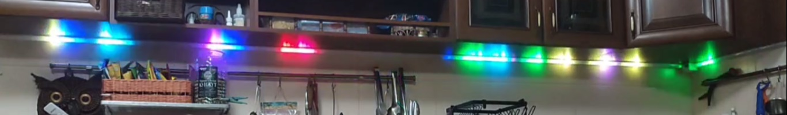

 

<p align="center">
    
    
    
    
</p>

**Addressable-Firework-Parus: Addressable LED Strip Effect for ESPHome**
Fireworks-Parus — эффект фейерверка (салюта) для адресной ленты в ESPHome

## 🌟 Описание Проекта

**эффект фейерверка (салюта) для адресной ленты в ESPHome**

Эффект имитирует взрыв фейерверка на одномерной светодиодной ленте:
Основная ракета взлетает с ускорением, замедляясь под действием «гравитации».
На заданной высоте происходит взрыв с постепенной эмиссией искр.
Искры разлетаются вверх/вниз, оставляют цветные хвосты и плавно затухают.
Особенность: все ключевые параметры управляются через слайдеры, что позволяет тонко настраивать динамику и внешний вид эффекта.

**Ключевые особенности**

***Возможности настройки***

Эффект реагирует на три слайдера:

*effect_speed (0–255)*

Увеличивает начальную скорость ракеты.
Повышает скорость разлёта искр.
Сокращает время затухания искр (чем быстрее — тем короче след).

*effect_intensity (0–255, инвертировано)*

Увеличивает количество искр при взрыве.
Уменьшает длину голов и хвостов искр (интенсивный взрыв = много мелких искр).
Сокращает длину головы основной ракеты.

*effect_scale (0–100)*

Опционально регулирует «силу гравитации» (ускорение свободного падения).
Позволяет сделать полёт ракеты более плавным или резким.

Проект основан на ESP8266 или ESP32
Тип ленты: любая адресная (WS2812B, SK6812 и др.).
---

## 🚀 Ключевые Функции

Взлёт ракеты:
Начальная скорость: 1.5–4.0 px/шаг.
Гравитация: –0.02…–0.04 px/шаг².
Голова ракеты: 1–3 пикселя.
Хвост ракеты: плавное затухание (8 пикселей).
Взрыв и искры:
Количество искр: 4–35 шт.
Скорость разлёта: 1.0–2.5 px/шаг.
Длина головы искры: 1–3 пикселя.
Длина хвоста искры: 4–12 пикселей.
Время затухания: 1.5–5.0 сек.
Цвета искр: случайная палитра (6 вариантов).

---

### Программные Зависимости
- **ESPHome**: Версия 2024+.

---

## 📋 Установка и Настройка

### 3. Настройка ESPHome
- Внесите код из файла проекта в основной файл ESPHome в качестве эффекта `addressable_lambda:` либо через include.

## 🔧 Расширенная Настройка

### Слайдеры для управления и настройки.
Добавьте слайдеры effect_speed, effect_scale, effect_intensity в конфигурацию ESPHome.
Вставьте код в блок addressable_lambda.
Настройте led_count (количество светодиодов) в вашей конфигурации.

Регулируйте эффект через веб‑интерфейс (например, ESPHome Dashboard).

```yaml
number:
 # Effect Settings
  - platform: template
    name: Effect Intensity
    icon: mdi:spotlight
    min_value: 0
    max_value: 255
    step: 1
    optimistic: true
    id: effect_intensity
    initial_value: 128
    mode: slider
  - platform: template
    name: Effect Speed
    icon: mdi:speedometer
    min_value: 0
    max_value: 255
    step: 1
    optimistic: true
    id: effect_speed
    initial_value: 128
    mode: slider
  - platform: template
    name: Effect Scale
    icon: mdi:drag-variant
    min_value: 0
    max_value: 100
    step: 1
    optimistic: true
    id: effect_scale
    initial_value: 50
    mode: slider
```
---

## 📊 Скриншоты и Видео

- [yaml файл прошивки](addressable_fireworks_parus.yaml)
- [Скриншот](addressable-fireworks-parus.jpg)
- [Видео YOUTUBE](https://youtu.be/iwBEjguX0Tw)

---

##  Дополнительные источники информации

Телеграм канал https://t.me/parus_smart

---
## 🙏 Благодарности

- ESPHome сообществу за отличный фреймворк.
- Home Assistant за интеграцию.
- Вам за использование! Если проект полезен, поставьте ⭐ на GitHub.
